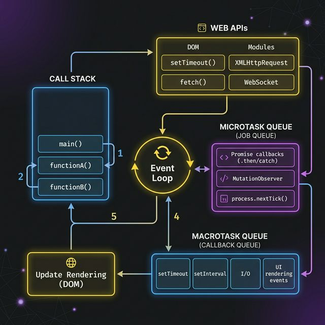

## The JavaScript Event Loop

JavaScript is a single-threaded language, which means it can only execute one command at a time. The **Event Loop** is what allows JS to perform non-blocking I/O operations despite its single-threaded nature.

## The Event Loop Architecture



### Core Components

1.  **Call Stack**:
    - This is where the JavaScript engine keeps track of function execution.
    - When a function is called, it's "pushed" onto the stack. When it finishes, it's "popped" off.
    - Since JS is single-threaded, it can only have one Call Stack.

2.  **Web APIs / Node APIs**:
    - These are provided by the environment (Browser or Node.js).
    - When you call `setTimeout`, the timer is handled here, not in the JS engine.
    - Other APIs include DOM events, AJAX (XMLHttpRequest/Fetch), and File System (Node).

3.  **Task Queue (Macrotasks)**:
    - When a Web API finishes (e.g., a timer expires), it pushes the callback into the Task Queue.
    - Macrotasks include: `setTimeout`, `setInterval`, `setImmediate`, I/O tasks.

4.  **Job Queue (Microtasks)**:
    - This is a special queue for high-priority tasks.
    - Microtasks include: `Promises` (.then/catch/finally), `MutationObserver`, `process.nextTick` (Node.js).
    - **Crucial Rule**: Microtasks are ALWAYS processed before the next macrotask.

## How it works

1. **Check Call Stack**: If the call stack is not empty, execute the code on the stack.
2. **If Empty (Macrotask vs Microtask)**:
   - Execute all tasks in the Microtask queue. (Microtasks ALWAYS execute first after a task).
   - If there are no more microtasks, take the FIRST task from the Macrotask queue and run it.
   - Repeatedly check for microtasks after each macrotask is done.

## Example

```javascript
console.log("1"); // Main execution context, on Stack.

setTimeout(() => {
  console.log("2"); // Macrotask, put into Macrotask queue.
}, 0);

Promise.resolve().then(() => {
  console.log("3"); // Microtask, put into Microtask queue.
});

console.log("4"); // Main execution context, on Stack.

// Output:
// 1
// 4
// 3 (Microtask always before first macrotask)
// 2
```

## Tips for performance

1. **Avoid blocking the Event Loop**: Don't run very heavy tasks on the main thread.
2. **Break down heavy computation**: Use `Web Workers` or use `setImmediate` / `setTimeout` to chunk your work.
