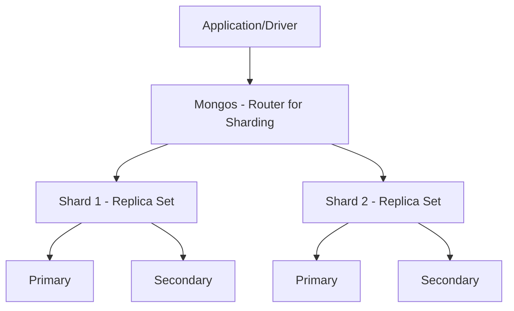

# MongoDB Core Architecture

MongoDB is a document-oriented NoSQL database designed for high availability, horizontal scalability, and developer productivity. Unlike traditional RDBMS, it moves away from the rigid table/row structure to a flexible Document/Collection model.

## 1. The BSON Specification

While users interact with MongoDB using JSON, the data is physically stored as **BSON (Binary JSON)**.

**Theory**: BSON is a binary-encoded serialization of JSON-like documents. It extends JSON by adding support for data types not available in JSON, such as `Date`, `BinData`, and `Decimal128`.

- **Efficiency**: BSON is designed to be efficient in space and traversal speed.
- **Traversability**: BSON includes "length" prefixes for elements, allowing the engine to "skip" irrelevant fields during a query without parsing the entire document.

## 2. The Schema-less Philosophy

MongoDB is often called "schema-less," but a more accurate term is **Dynamic Schema**.

**Theory**: In a relational database, the schema is enforced at the database level (_Schema-on-Write_). In MongoDB, the schema is often enforced at the application level or via JSON Schema validation (_Schema-on-Read_). This allows for polymorphic data—documents in the same collection can have different structures.

## 3. Storage Engine: WiredTiger

Since version 3.2, **WiredTiger** is the default storage engine.

- **Document-Level Concurrency Control**: Unlike older engines that used collection-level locks, WiredTiger uses optimistic concurrency control, allowing multiple threads to modify different documents in the same collection simultaneously.
- **Compression**: It uses Snappy or zLib compression by default, significantly reducing the disk footprint.
- **Journaling**: It uses a write-ahead log (WAL) to ensure data durability in case of a crash.

## 4. Key Architectural Components

- **Mongod**: The primary daemon process that handles data requests and manages background operations.
- **Mongos**: The routing service for sharded clusters.
- **Replica Sets**: Provide high availability through automatic failover and data redundancy.
