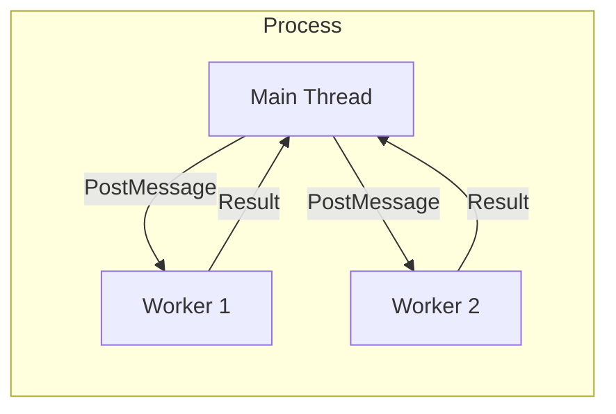

# Parallelism in Node.js

Although Node.js is single-threaded, it can leverage multi-core systems using two main approaches: **Multi-processing (Cluster)** and **Multi-threading (Worker Threads)**.

## 1. The Cluster Module (Multi-processing)

**Theory**: The `cluster` module allows you to spawn multiple copies of the same Node.js process.

- **Primary Process**: Handles the master logic and distributes incoming connections using a **Round-Robin** strategy (on Unix).
- **Worker Processes**: Independent processes with their own memory, V8 instance, and Event Loop.
- **Port Sharing**: The master process listens on a port (e.g., 3000) and passes the TCP handle to workers.

```javascript
if (cluster.isPrimary) {
  for (let i = 0; i < numCPUs; i++) cluster.fork();
} else {
  http.createServer((req, res) => res.end("Hello")).listen(3000);
}
```

## 2. Worker Threads (Multi-threading)

Introduced in Node.js 10.5.0, `worker_threads` allow executing JavaScript in parallel on the same process.

**Theory**: Unlike `cluster` (separate processes), Worker Threads share the same process but have their own **V8 Isolate** and **Event Loop**.

- **Shared Memory**: You can share memory between threads using `SharedArrayBuffer`. This is much faster than the Inter-Process Communication (IPC) used in clusters.
- **When to use?**: Use Worker Threads for **CPU-intensive** tasks (e.g., image processing, encryption, heavy calculations) within a single server instance.

## 3. Implementation Comparison

| Feature           | Cluster Module               | Worker Threads                  |
| :---------------- | :--------------------------- | :------------------------------ |
| **Model**         | Multi-process                | Multi-thread                    |
| **Memory**        | Isolated (Heavy)             | Shared (Lightweight)            |
| **Communication** | IPC (Serialization)          | MessagePort / SharedArrayBuffer |
| **Overhead**      | High (Process startup)       | Low (Thread startup)            |
| **Best for**      | High-concurrency Web Servers | Intensive Data Processing       |

## 4. The `worker_threads` Architecture



## 5. Child Processes: `exec` vs `spawn`

**Theory**: Sometimes you need to run external commands (like `git` or `ffmpeg`).

- **`spawn`**: Streams the output. Best for large data or long-running processes.
- **`exec`**: Buffers the entire output. Best for small commands where you need the final result.
