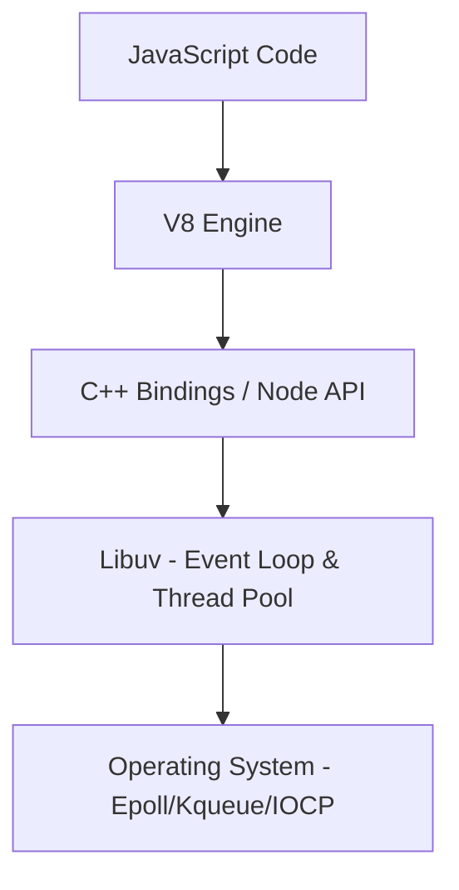

# Node.js Core Architecture

Node.js is an open-source, cross-platform JavaScript runtime environment that executes JavaScript code outside a web browser. Its signature feature is the **Asynchronous, Non-blocking I/O model**.

## 1. The Three Pillars of Node.js

Node.js is built on three primary components:

1.  **V8 Engine**: Developed by Google for Chrome, written in C++. It compiles JavaScript directly to native machine code before executing it.
2.  **Libuv**: A multi-platform C library that provides support for asynchronous I/O based on events. It handles the **Thread Pool**, **Event Loop**, and **File System** operations.
3.  **C++ Bindings (Node API)**: The layer that allows JavaScript to communicate with the underlying C++ code (V8 and Libuv).

## 2. The Internal Architecture

## 3. The Non-blocking I/O Theory

**Theory**: In traditional multi-threaded servers (like Apache), each request creates a new thread. If a request is waiting for a database (I/O), the thread is blocked. Node.js uses a **Single Threaded Event Loop** but delegates I/O tasks to the OS or the Libuv Thread Pool.

- When the task is done, it pushes a callback to the **Callback Queue**.
- The Event Loop picks it up when the execution stack is empty.
- This allows a single thread to handle thousands of concurrent connections.

## 4. Why Single Threaded?

**Theory**: By being single-threaded, Node.js avoids the memory overhead and complexity of **Context Switching** and **Race Conditions** associated with traditional multi-threaded environments.

- **Memory**: Each thread in a Java/C# server might take 1-2MB. Thousands of threads can exhaust RAM. Node.js stays lightweight.
- **CPU**: Parallelism for CPU-intensive tasks is handled via **Worker Threads** or **Cluster Module**, keeping the main loop responsive.
