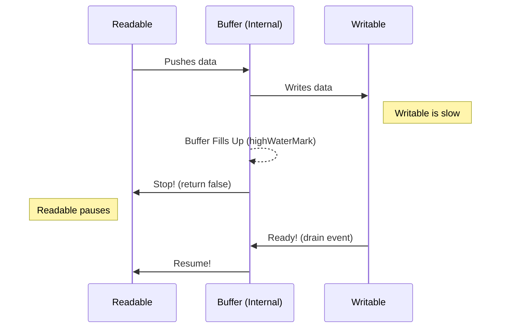

# Streams and Buffers

Handling large datasets efficiently requires moving away from reading entire files into RAM. Node.js provides **Streams** and **Buffers** for this purpose.

## 1. Buffers: The Binary Container

**Theory**: A `Buffer` is a chunk of memory allocated outside the V8 heap. It is used to handle binary data directly.

- **Fixed Size**: Once created, a buffer's size cannot be changed.
- **Typed Data**: Useful for handling network packets, file system chunks, and image binary data.

## 2. Streams: The Flow of Data

**Theory**: A stream is an abstract interface for working with streaming data. Instead of reading a 1GB file into a 1GB variable, you process it line-by-line or chunk-by-chunk.

### Four Types of Streams

1.  **Readable**: Source of data (e.g., `fs.createReadStream`).
2.  **Writable**: Destination for data (e.g., `fs.createWriteStream`).
3.  **Duplex**: Both Readable and Writable (e.g., a TCP socket).
4.  **Transform**: A Duplex stream that can modify data as it is written/read (e.g., `zlib.createGzip`).

## 3. The `pipe()` and `pipeline()` Method

**Theory**: Piping connects the output of a Readable stream to the input of a Writable stream.

```javascript
readable.pipe(writable);
```

**Why use `pipeline`?**
Using `.pipe()` is convenient but doesn't handle errors well (if the middle stream fails, the destination is never closed). `stream.pipeline()` provides a cleaner way to handle errors and clean up resources dynamically.

## 4. Backpressure Theory

**Theory**: Backpressure occurs when a **Readable** stream produces data faster than a **Writable** stream can consume it.



- **highWaterMark**: The limit (default 16KB for strings/buffers) beyond which the stream will signal backpressure.

## 5. Memory Management

Using streams reduces the **Resident Set Size (RSS)** of your application.

- **Bad**: `fs.readFileSync` (Reads entire file into RAM, potentially crashing if file > RAM).
- **Good**: `fs.createReadStream` (Uses a constant, small amount of memory regardless of file size).
